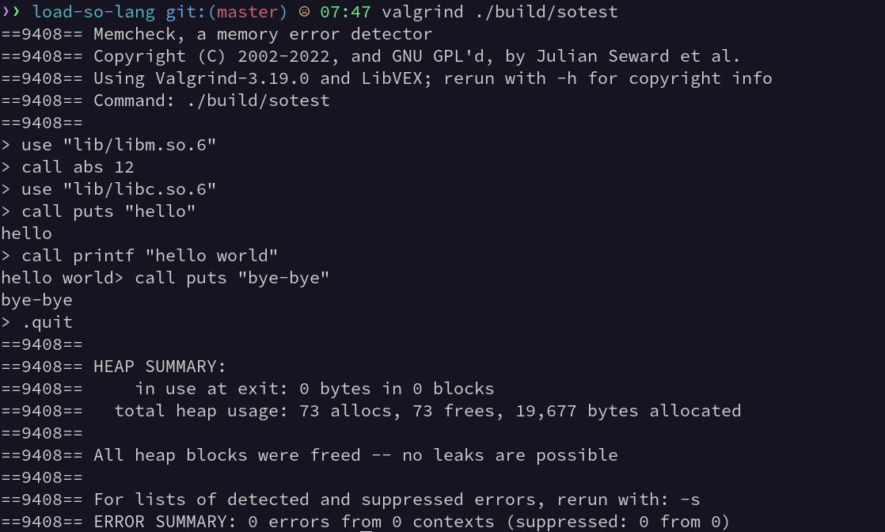
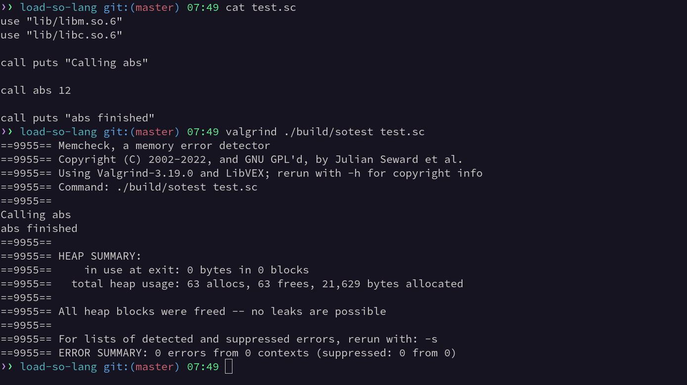

# sotest

A tiny interpreter for loading and testing shared libraries.

## Installation

You'll need a C compiler and CMake installed.

```
git clone https://github.com/aloussase/sotest
cd sotest
cmake -B build -S . -DCMAKE_BUILD_TYPE=Release
cmake --build build
```

## Usage

To spawn a REPL:

```
./build/sotest
```

To evaluate the contents of a file:

```
./build/sotest <filename>
```

Replace `<filename>` with the name of your script. You can use the included
`test.sc` script to test the interpreter if you want.

## Demo

### Interactive mode



### Batch mode

